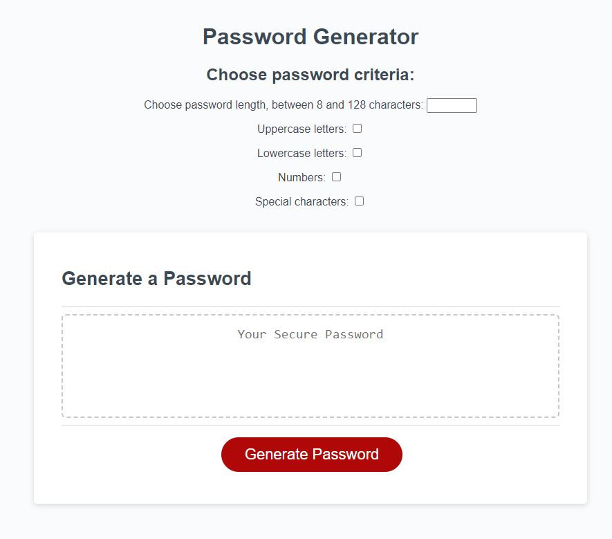

# Password Generator
Module 3 challenge

## Description
This site was create to allow employees to generate a password that meets a certain criteia, specified by the employee.

## Usage
To open the site click on the following link.\
https://angiem07.github.io/Password-Gen/

Below is a preview of the site.

To generate a password select the wished criteria.
Then click the "Generate Password" button and the password will display inside the dotted box.

## Credits
Original code given by bootcamp course.

References:\
https://developer.mozilla.org/en-US/docs/Web/HTML/Element/input\
https://developer.mozilla.org/en-US/docs/Web/HTML/Element/label\
https://stackoverflow.com/questions/73765662/random-password-generator-returning-orderly-password-instead-of-random-password\
https://www.reddit.com/r/AskProgramming/comments/katbot/javascript_help_with_password_generator/\

Debug:\
chatGPT\

## License
N/A

